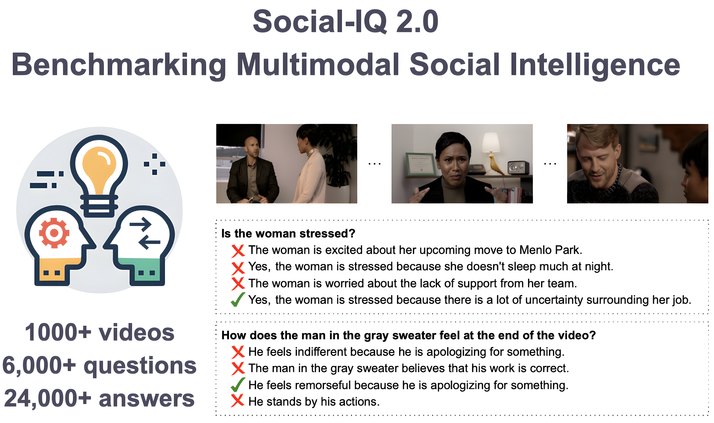

<!-- # The Social-IQ 2.0 Challenge -->

<p align="center">
<em>Sample questions from the Social-IQ 2.0 VideoQA task.</em>
</p>
&nbsp;&nbsp;&nbsp;&nbsp;

The <b>[Social-IQ 2.0 Challenge](https://cmu-multicomp-lab.github.io/social-iq-2.0/)</b> is designed to benchmark recent AI technologies' skills to reason about social interactions, which is referred as Artificial Social Intelligence. This challenge will be part of ICCV 2023 Workshop on Artificial Social Intelligence. The Social-IQ 2.0 dataset contains over 1,000 videos, accompanied with 6,000+ multiple-choice questions. The challenge plans to award over $1,200 in total prizes, and will be co-hosted with the [Artificial Social Intelligence Workshop](https://sites.google.com/view/asi-iccv-2023/home) at [ICCV '23](https://iccv2023.thecvf.com).

**Challenge pre-registration**: Potential participants are asked to fill this simple online [form](https://forms.gle/ZVTAvNunBQUa9ncJ6) with your email address so that we can keep you informed of relevant updates about the challenge.

## Important Dates 📅
- [x] Challenge is released: <b>May 15</b>
- [x] Challenge and paper submission sites open, test set released: ~~mid-June~~ **early-July**
- [ ] Paper submissions and final challenge submissions due to the [submission site](https://cmt3.research.microsoft.com/asisiqiccv2023): ~~July 21~~ **July 24, AOE (Anywhere on Earth)**
- [ ] Acceptance decisions issued: <b>August 4</b>
- [ ] Camera ready paper due: <b>August 11</b>
- [ ] ICCV workshop: <b>October 2</b>

## Awards 🏆 and Prizes 💰
There will be over $1,200 in prizes. We will give the following awards and may create additional awards as well.
- **Challenge Winner**: highest-performing submission
- **Best Few-Shot Paper**: best paper in the Few-Shot Research Focus (see description below)
- **Best Fusion and Reasoning Paper**: best paper in the Fusion and Reasoning Focus (see description below)

## Research Focuses 🔍
The study of artificial social intelligence brings many technical challenges for computer vision, natural language processing and machine learning. In order to encourage diversity in the proposed approaches, two of the awards will be given to the following two categories: Few-shot Research Focus and Fusion and Reasoning Focus. We also invite submissions in a third category: Representation Learning Focus. All three categories are described below.

### Few-Shot Focus 🎯
This research category is intended to encourage submission that are taking advantage of recent pretrained models and focus on composing these foundation models in a zero- or few-shot manner. One advantage of this research category is that it is potential accessible to a broader community, even with limited computations. As pre-trained foundation models will improve, it is an important research question to evaluate and benchmark their skills in understanding social interactions. Researchers can even decide to focus only on language as an intermediate representation, such as proposed in the [Socratic Models](https://socraticmodels.github.io/). It is ok to use API-accessed models such as ChatGPT and Bard.

Papers in this category should either use none of the training samples from Social-IQ 2.0 dataset (zero-shot learning) or very few of them, usually below 10 samples (few-shot learning).

### Fusion and Reasoning Focus 🧠
This category is designed to foster research that explore new techniques to fuse multimodal information. Research papers in this category should focus on the fusion and reasoning parts of the algorithms, instead to the representation learning part (see the 3rd paper category below for description of representation learning focus). Since the focus is on the fusion and not about training new feature representation models (e.g., fine-tuning a pre-trained model), we expect models trained in this category to have fewer parameters to train and instead focus on how to best fuse multimodal information and reason over the observed premises. The reasoning can happen over multiple events (e.g., each speaking turn) present in the video. An inspiration in this category is the family of models that grew from the [Neural State Machine](https://arxiv.org/pdf/1907.03950.pdf).

Papers in this category should not try to fine-tune the pretrained models used for feature extraction and instead focus on learning a new model to fuse and reason over these multimodal features. Social-IQ 2.0 training dataset will be used to learning this fusion and reasoning module.

### Representation Learning Focus 🎛️
We added this third category to acknowledge all the impactful research happening in multimodal representation learning. We acknowledge that not all researchers will have the computation power to train or fine-tune these large models, and this is why no direct award will be given to this category, beyond the Challenge Winner award. But we still believe that it is important to mention this research category. For this category, you may use as much compute as you would like, provided (as with all challenge submissions) that you only use data in the Social-IQ 2.0 dataset release for your training. Please reach out to us if you intend to use specialized hardware such as TPU’s, so we can ensure your code is reproducible. If you would like to use TPU’s, we recommend applying for [this program from Google](https://sites.research.google/trc/about/); their generous support allowed us to run the MERLOT-Reserve baselines for this challenge. You may decide to explore self-supervised setting (where the labels are not used during the representation learning phase) or directly train your representation model in a supervised setting such as MERLOT’s finetuning results.

## Paper Submissions 📤
For submissions to be considered for the Social-IQ 2.0 challenge, teams are required to submit a research paper describing the approach in detail and share a link to their github repository. This github link will enable the review committee to ensure that results are genuine and reproducible. During paper submission, please specify the research focus (out of the three categories previously mentioned) you would like your paper to be considered for. Please format your papers according to [ICCV's submission guidelines](https://iccv2023.thecvf.com/submission.guidelines-361600-2-20-16.php). Papers can be up to 6 pages (with no cap on additional pages for references and appendices). You can submit through CMT at the link below:

[**Paper and Challenge Submission Link**](https://cmt3.research.microsoft.com/asisiqiccv2023)

## Challenge Submissions 🏔️
It is expected that teams will use the validation data split to evaluate their model performance. Once a promising approach is found, teams will submit their predictions on the test set (`siq2/qa/qa_test.json`) along with their paper pdf using the online submission site linked above. Performance on the test set will be used to decide the Challenge Winner. The `qa_test.json` file in this repository is a superset of the test set that will be used for scoring.

The `qa_test.json` file does not have labels, so please indicate your method's predicted labels by adding a field "answer_idx" with an index between 0 and 3 for each question.

In essence, the current qa_test.json contains the following fields: [qid, q, vid_name, ts, a0, a1, a2, a3]. Your qa_test.json will contain: [qid, q, vid_name, ts, a0, a1, a2, a3, **answer_idx**], where answer_idx indicates which index your model believes is the answer for this question.

**Please do not alter the other field names, or include any other fields in your submission**.

IMPORTANT: Please do not perform additional training or adaptation on the test set. The training should be oly happening on the training set of the Social-IQ 2.0 dataset.

## Review Criteria 🎉
The following four criteria will be taken into consideration during the review process:
1. The contribution / novelty of the approach
2. The reproducibility of the results
3. The clarity of the writing
4. Experimental results and analysis

The review process will also be taking into consideration the category specified for the research focus. Innovative approaches in few-shot or zero-shot settings are particularly interesting. Similarly for new techniques to perform fusion and reasoning. In addition, we believe that negative results also have a place in these competitions, as long as they are accompanied with insightful discussions, so future researchers can learn from your experience.

## The Social-IQ 2.0 Dataset
We provide scripts to download the videos and question / answer files of Social-IQ 2.0 dataset. The videos are from three different categories: general youtube videos containing socially rich situations, short clips from movies, and clips containing socially rich situations in passenger vehicles.

The `siq2` folder looks like this:
```
siq2
├── audio
│   ├── mp3 # will contain mp3 files
│   └── wav # will contain wav files
├── download_all.py
├── frames
├── original_split.json # contains which video ids are in train/val/test splits for the different subsets: youtubeclips, movieclips, car clips
├── qa # contains question / answer labelled data; will contain unlabelled qa_test.json file when submission site is released
│   ├── qa_train.json
│   └── qa_val.json
├── requirements.txt
├── transcript # will contain .vtt transcript files
├── trims.json # contains start times for the videos; videos are 60 seconds long from that start second
└── video # will contain .mp4 video files
└── youtube_utils.py
```

To download the data, first install all required dependencies:
```
conda create -n siq2 python=3.8 -y && conda activate siq2
pip install -r requirements.txt
sudo apt update && sudo apt install ffmpeg # or however you need to install ffmpeg; varies per machine
```

Then, run the following to download the dataset
```
python siq2/download_all.py # this takes about 4 hours to download and 60GB to store the whole dataset. This goes down to 30GB if you run with flag --no_frames
```
This will update `siq2/current_split.json`, which will describe the videos in the train/val/test splits. There is also `siq2/original_split.json`, which contains all the video ID's we have questions and answers for, regardless of whether they're available at the moment on youtube or not.

**A finer point about the dataset**: Because you will download videos from youtube directly, the set of videos that constitute the dataset may change slightly between the release and conclusion of the challenge. **We will treat the "final" dataset as the set of videos downloaded from youtube one week before the challenge concludes**. If you download the dataset now and report your results later, that is ok – we will simply discard predictions made on test set videos that are no longer available when we determine final testing accuracies, and you will not be penalized for training or validating on videos that are no longer available by the end of the challenge.

## Citation
Please cite this repo if you use the Social-IQ 2.0 challenge data in your research.

```
@misc{siq2,
  author = {Alex Wilf and Leena Mathur and Sheryl Mathew and Claire Ko and Youssouf Kebe and Paul Pu Liang and Louis-Philippe Morency},
  title = {Social-IQ 2.0 Challenge: Benchmarking Multimodal Social Understanding},
  year = {2023},
  publisher = {GitHub},
  journal = {GitHub repository},
  howpublished = {\url{https://github.com/abwilf/Social-IQ-2.0-Challenge}},
}
```

## Questions
If you have any questions, please open a Github issue on this repository or email awilf@cs.cmu.edu

The [Social-IQ 2.0 Challenge](https://cmu-multicomp-lab.github.io/social-iq-2.0/) was created by the [MultiComp Lab](http://multicomp.cs.cmu.edu) at [CMU](https://www.cmu.edu). 
